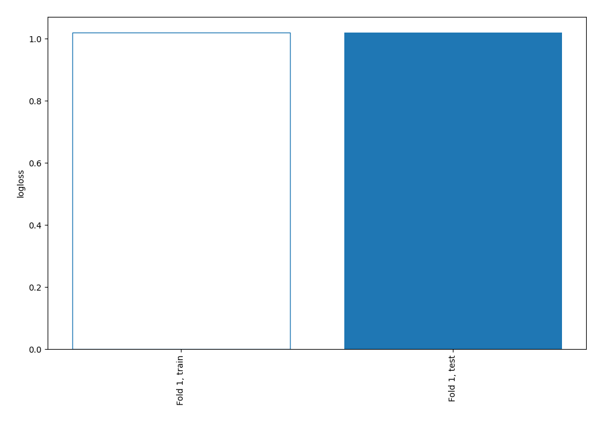
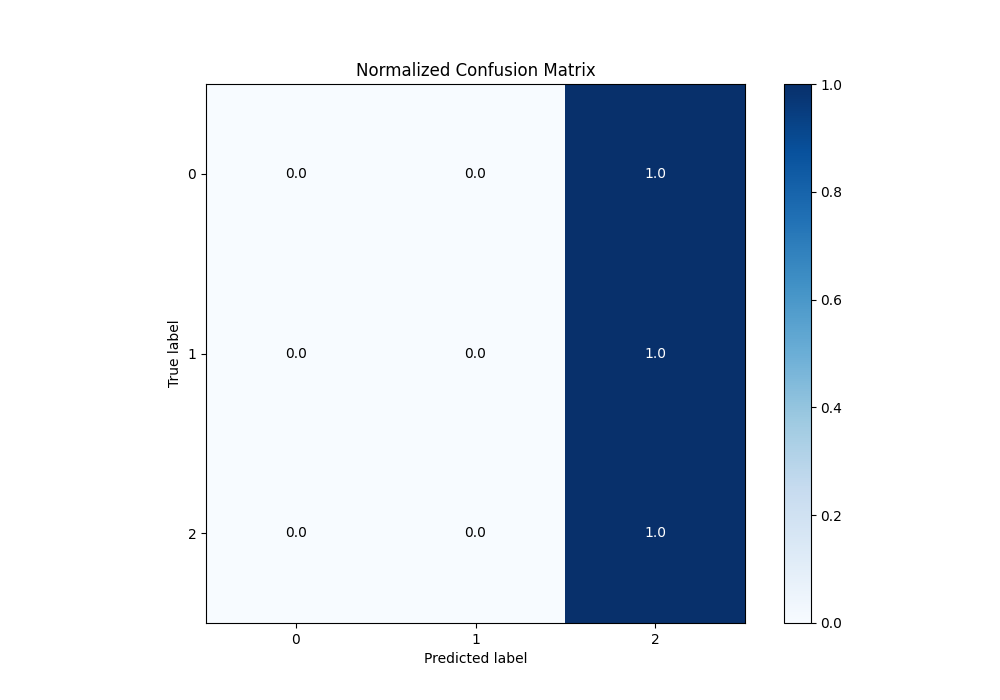

# Summary of 1_Baseline

[<< Go back](../README.md)

## Baseline Classifier (Baseline)
- **n_jobs**: -1
- **num_class**: 3
- **explain_level**: 2

## Validation
 - **validation_type**: split
 - **train_ratio**: 0.75
 - **shuffle**: True
 - **stratify**: True

## Optimized metric
logloss

## Training time

0.2 seconds

### Metric details
|           |   0 |   1 |          2 |   accuracy |   macro avg |   weighted avg |   logloss |
|:----------|----:|----:|-----------:|-----------:|------------:|---------------:|----------:|
| precision |   0 |   0 |   0.499435 |   0.499435 |    0.166478 |       0.249435 |   1.01991 |
| recall    |   0 |   0 |   1        |   0.499435 |    0.333333 |       0.499435 |   1.01991 |
| f1-score  |   0 |   0 |   0.666164 |   0.499435 |    0.222055 |       0.332706 |   1.01991 |
| support   | 284 | 159 | 442        |   0.499435 |  885        |     885        |   1.01991 |

## Confusion matrix
|              |   Predicted as 0 |   Predicted as 1 |   Predicted as 2 |
|:-------------|-----------------:|-----------------:|-----------------:|
| Labeled as 0 |                0 |                0 |              284 |
| Labeled as 1 |                0 |                0 |              159 |
| Labeled as 2 |                0 |                0 |              442 |

## Learning curves

## Confusion Matrix

## Normalized Confusion Matrix

## ROC Curve

## Precision Recall Curve

[<< Go back](../README.md)
