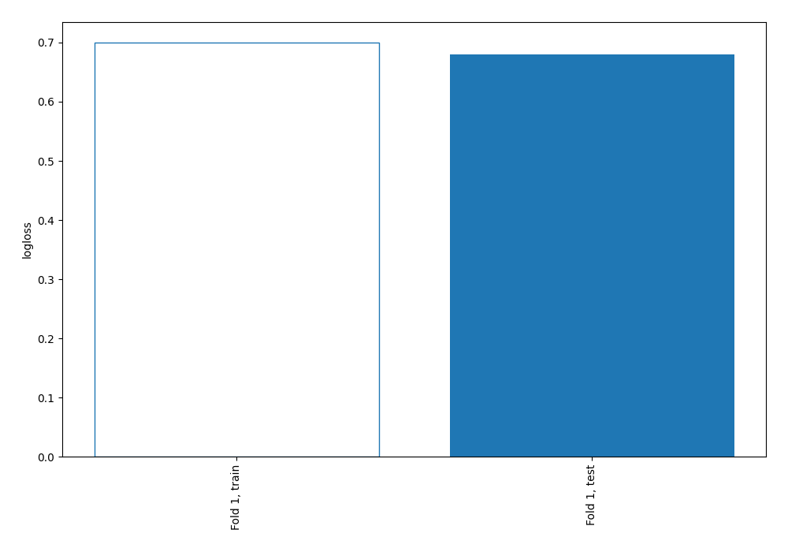
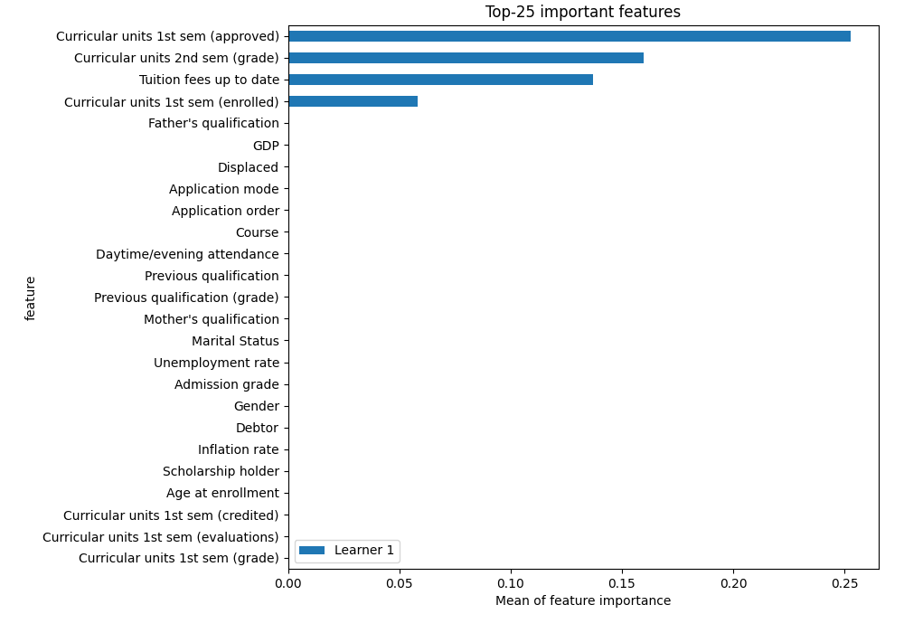
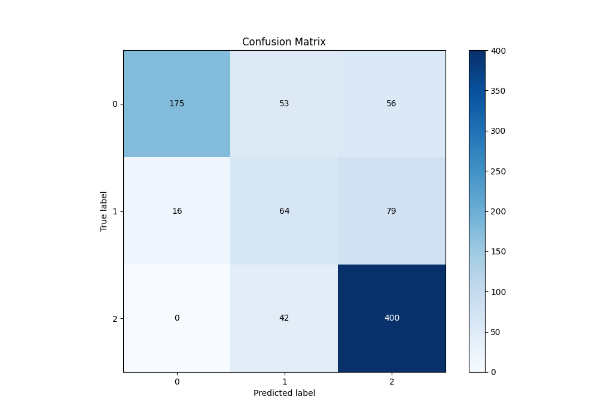
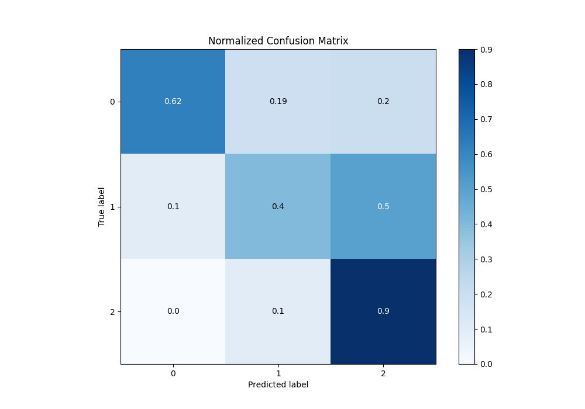
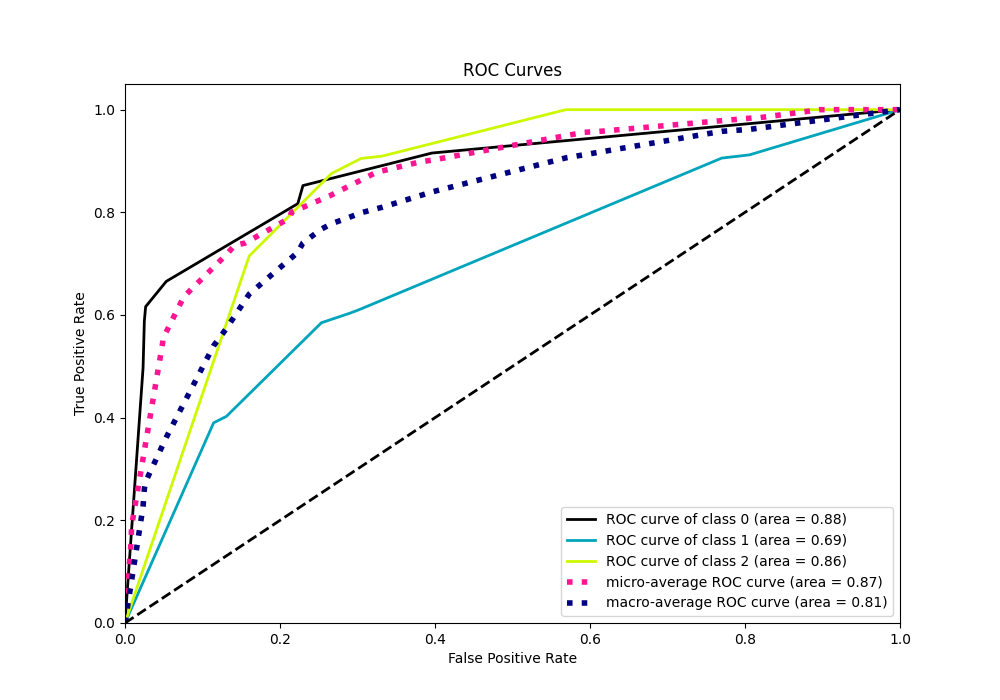
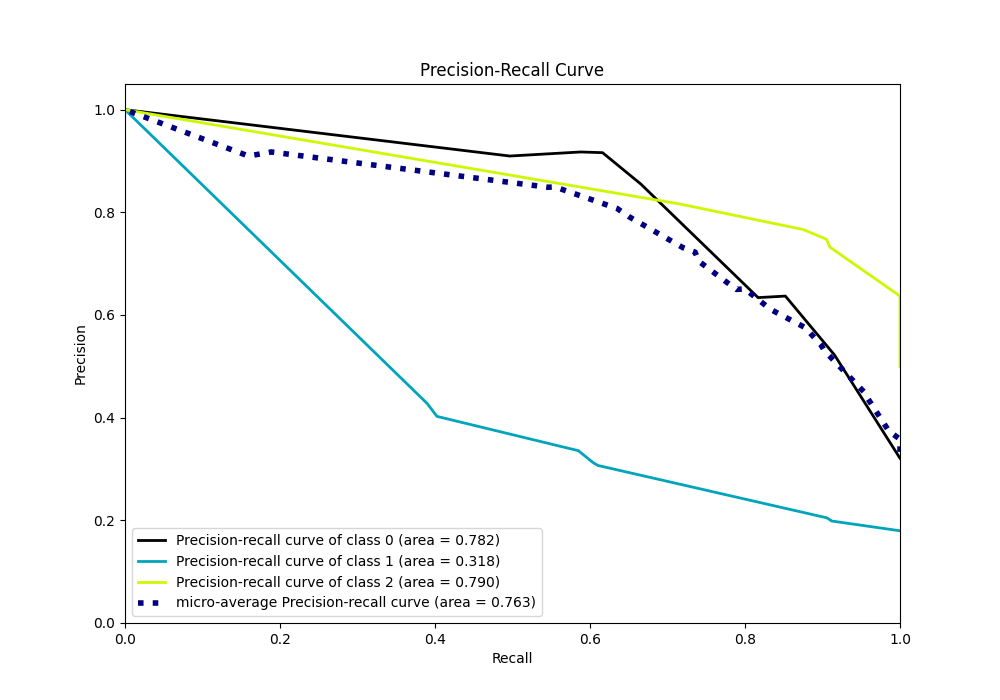

# Summary of 2_DecisionTree

[<< Go back](../README.md)

## Decision Tree
- **n_jobs**: -1
- **criterion**: gini
- **max_depth**: 3
- **num_class**: 3
- **explain_level**: 2

## Validation
 - **validation_type**: split
 - **train_ratio**: 0.75
 - **shuffle**: True
 - **stratify**: True

## Optimized metric
logloss

## Training time

2.2 seconds

### Metric details
|           |          0 |          1 |          2 |   accuracy |   macro avg |   weighted avg |   logloss |
|:----------|-----------:|-----------:|-----------:|-----------:|------------:|---------------:|----------:|
| precision |   0.91623  |   0.402516 |   0.747664 |   0.722034 |    0.688803 |       0.739748 |  0.680112 |
| recall    |   0.616197 |   0.402516 |   0.904977 |   0.722034 |    0.64123  |       0.722034 |  0.680112 |
| f1-score  |   0.736842 |   0.402516 |   0.818833 |   0.722034 |    0.65273  |       0.717726 |  0.680112 |
| support   | 284        | 159        | 442        |   0.722034 |  885        |     885        |  0.680112 |

## Confusion matrix
|              |   Predicted as 0 |   Predicted as 1 |   Predicted as 2 |
|:-------------|-----------------:|-----------------:|-----------------:|
| Labeled as 0 |              175 |               53 |               56 |
| Labeled as 1 |               16 |               64 |               79 |
| Labeled as 2 |                0 |               42 |              400 |

## Learning curves

## Permutation-based Importance

## Confusion Matrix

## Normalized Confusion Matrix

## ROC Curve

## Precision Recall Curve

[<< Go back](../README.md)
