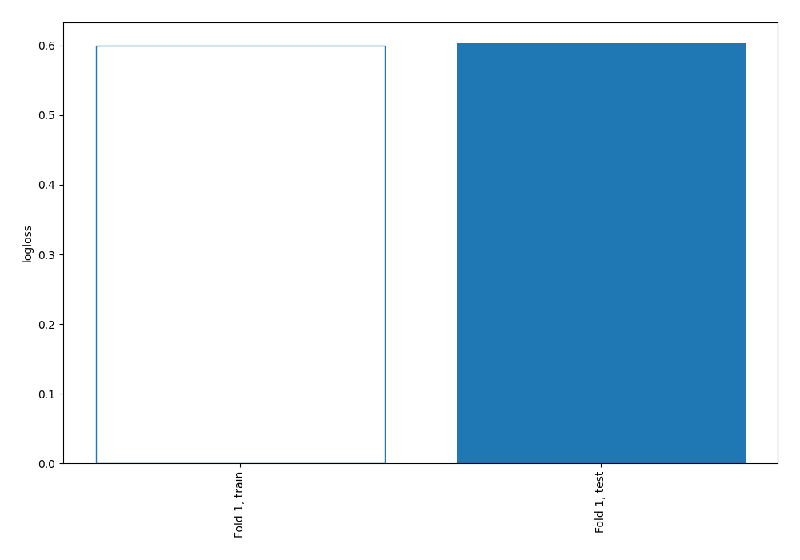
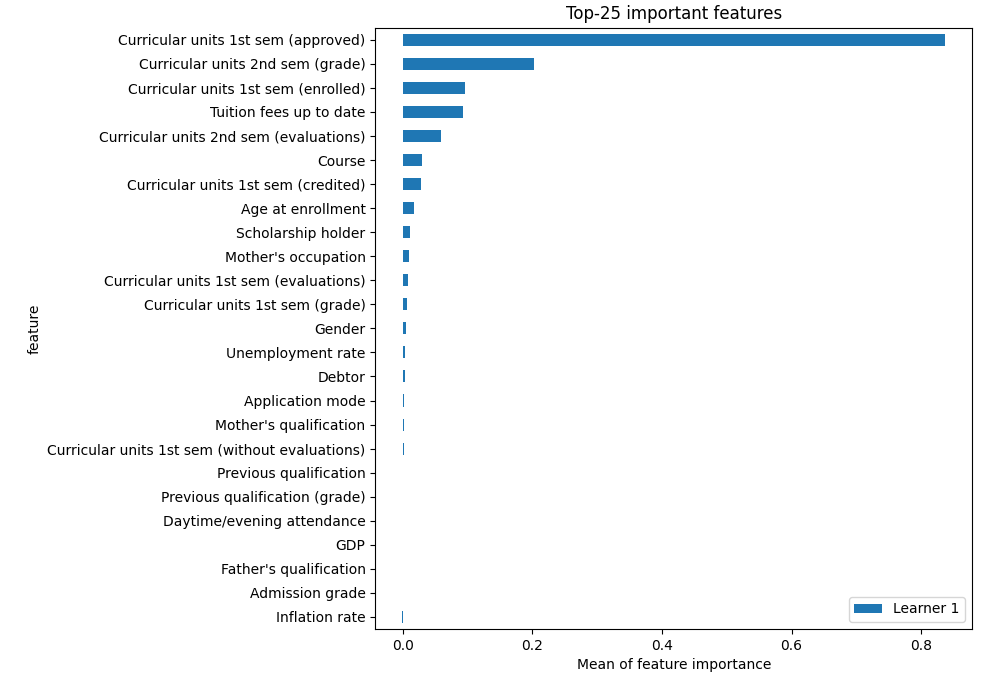
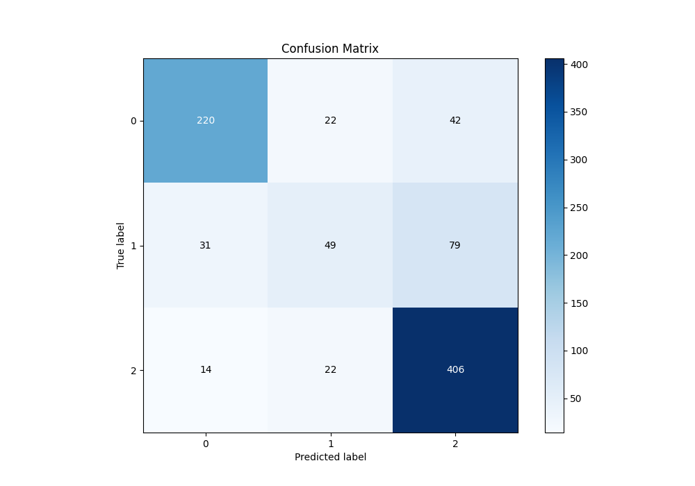
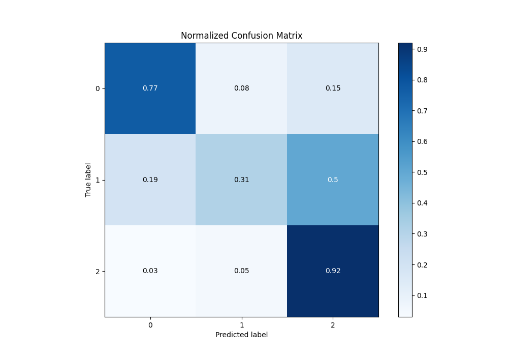
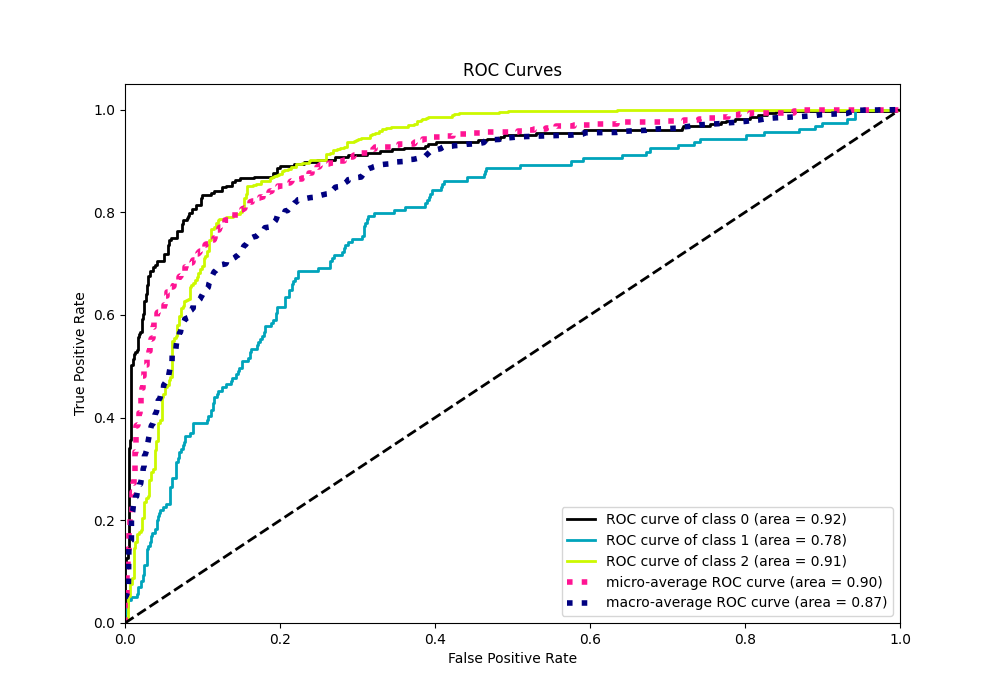
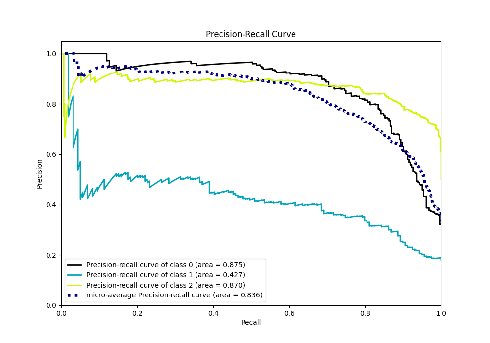

# Summary of 3_Linear

[<< Go back](../README.md)

## Logistic Regression (Linear)
- **n_jobs**: -1
- **num_class**: 3
- **explain_level**: 2

## Validation
 - **validation_type**: split
 - **train_ratio**: 0.75
 - **shuffle**: True
 - **stratify**: True

## Optimized metric
logloss

## Training time

1.0 seconds

### Metric details
|           |          0 |          1 |          2 |   accuracy |   macro avg |   weighted avg |   logloss |
|:----------|-----------:|-----------:|-----------:|-----------:|------------:|---------------:|----------:|
| precision |   0.830189 |   0.526882 |   0.770398 |   0.762712 |    0.709156 |       0.745835 |  0.603148 |
| recall    |   0.774648 |   0.308176 |   0.918552 |   0.762712 |    0.667125 |       0.762712 |  0.603148 |
| f1-score  |   0.801457 |   0.388889 |   0.837977 |   0.762712 |    0.676108 |       0.745574 |  0.603148 |
| support   | 284        | 159        | 442        |   0.762712 |  885        |     885        |  0.603148 |

## Confusion matrix
|              |   Predicted as 0 |   Predicted as 1 |   Predicted as 2 |
|:-------------|-----------------:|-----------------:|-----------------:|
| Labeled as 0 |              220 |               22 |               42 |
| Labeled as 1 |               31 |               49 |               79 |
| Labeled as 2 |               14 |               22 |              406 |

## Learning curves

## Coefficients

### Coefficients learner #1
|                                                |           0 |            1 |           2 |
|:-----------------------------------------------|------------:|-------------:|------------:|
| intercept                                      |  0.0547166  | -0.151545    |  0.0968285  |
| Marital Status                                 | -0.0714401  |  0.017102    |  0.0543382  |
| Application mode                               |  0.0131351  |  0.0880049   | -0.10114    |
| Application order                              |  0.0774993  | -0.090073    |  0.0125737  |
| Course                                         |  0.339041   | -0.00196734  | -0.337074   |
| Daytime/evening attendance                     | -0.0144937  |  0.0192726   | -0.00477892 |
| Previous qualification                         | -0.0711213  | -0.0202506   |  0.0913718  |
| Previous qualification (grade)                 |  0.0328915  | -0.0422876   |  0.0093961  |
| Mother's qualification                         |  0.0533603  | -0.0940888   |  0.0407286  |
| Father's qualification                         |  0.00686151 |  0.000838999 | -0.0077005  |
| Mother's occupation                            | -0.191959   |  0.145582    |  0.046377   |
| Admission grade                                | -0.0740769  | -0.0265592   |  0.100636   |
| Displaced                                      |  0.15393    | -0.0943509   | -0.0595792  |
| Debtor                                         |  0.472262   |  0.186796    | -0.659059   |
| Tuition fees up to date                        | -0.54185    |  0.0877146   |  0.454135   |
| Gender                                         |  0.25263    |  0.0533863   | -0.306016   |
| Scholarship holder                             | -0.360299   | -0.22712     |  0.587419   |
| Age at enrollment                              |  0.252162   | -0.193651    | -0.0585108  |
| Curricular units 1st sem (credited)            |  0.36199    | -0.0100886   | -0.351902   |
| Curricular units 1st sem (enrolled)            |  0.648883   |  0.0113451   | -0.660228   |
| Curricular units 1st sem (evaluations)         | -0.123919   |  0.145725    | -0.0218055  |
| Curricular units 1st sem (approved)            | -1.34986    | -0.597205    |  1.94706    |
| Curricular units 1st sem (grade)               |  0.102641   |  0.0776683   | -0.180309   |
| Curricular units 1st sem (without evaluations) | -0.154765   | -0.0840731   |  0.238839   |
| Curricular units 2nd sem (evaluations)         |  0.163805   |  0.350004    | -0.513809   |
| Curricular units 2nd sem (grade)               | -0.78103    | -0.00304281  |  0.784073   |
| Curricular units 2nd sem (without evaluations) | -0.0264552  | -0.0707216   |  0.0971769  |
| Unemployment rate                              |  0.109817   | -0.103084    | -0.00673298 |
| Inflation rate                                 |  0.0355368  | -0.0286971   | -0.0068397  |
| GDP                                            | -0.00308586 | -0.022934    |  0.0260199  |

## Permutation-based Importance

## Confusion Matrix

## Normalized Confusion Matrix

## ROC Curve

## Precision Recall Curve

[<< Go back](../README.md)
