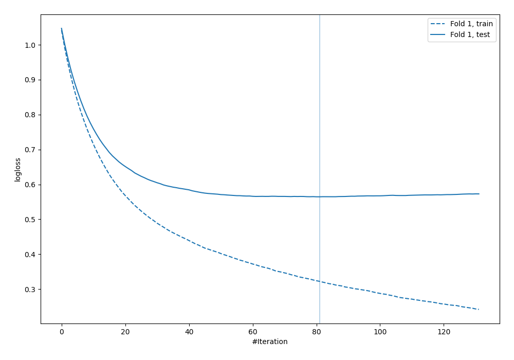
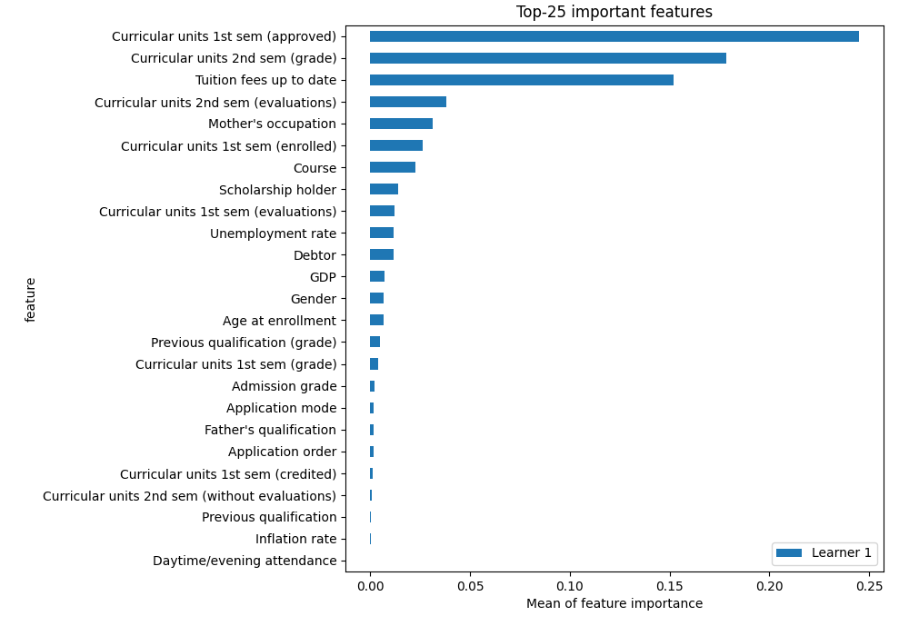
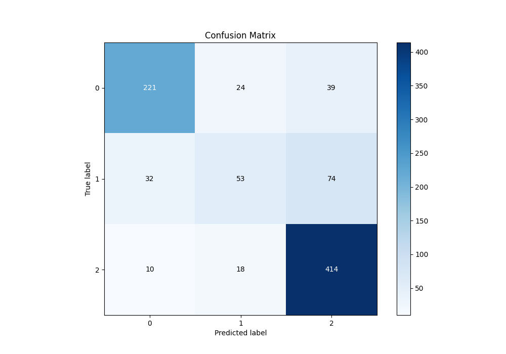
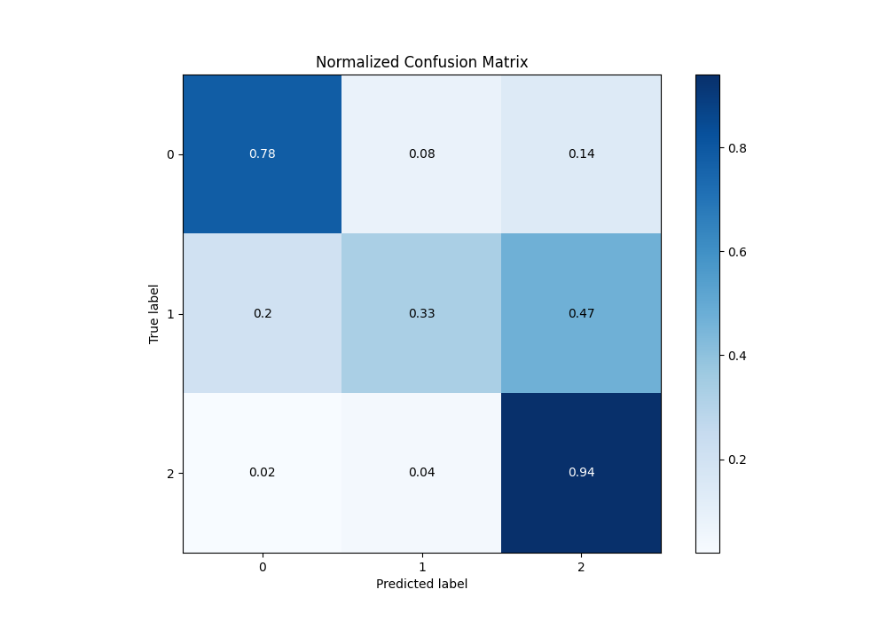
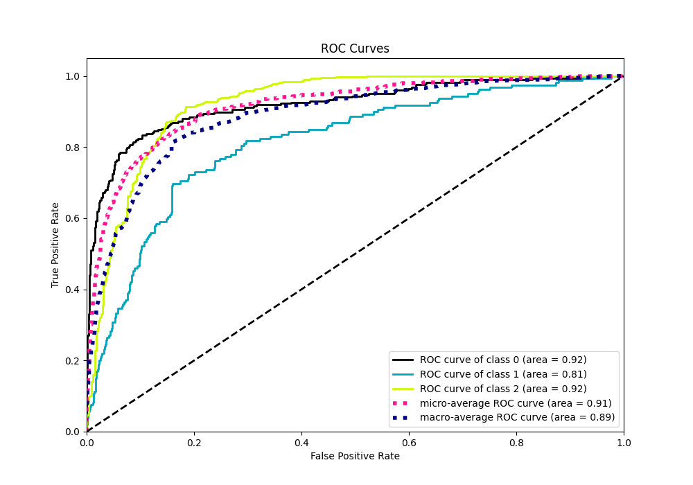
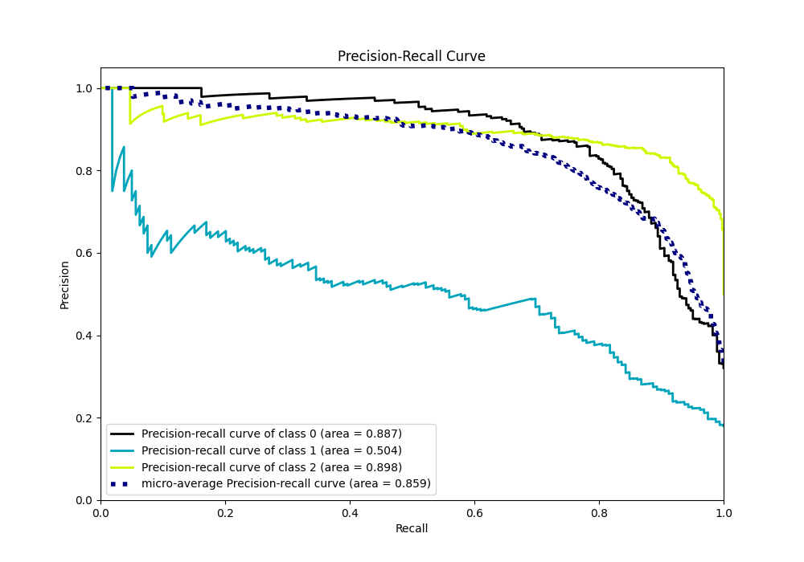

# Summary of 4_Default_Xgboost

[<< Go back](../README.md)

## Extreme Gradient Boosting (Xgboost)
- **n_jobs**: -1
- **objective**: multi:softprob
- **eta**: 0.075
- **max_depth**: 6
- **min_child_weight**: 1
- **subsample**: 1.0
- **colsample_bytree**: 1.0
- **eval_metric**: mlogloss
- **num_class**: 3
- **explain_level**: 2

## Validation
 - **validation_type**: split
 - **train_ratio**: 0.75
 - **shuffle**: True
 - **stratify**: True

## Optimized metric
logloss

## Training time

3.9 seconds

### Metric details
|           |          0 |          1 |          2 |   accuracy |   macro avg |   weighted avg |   logloss |
|:----------|-----------:|-----------:|-----------:|-----------:|------------:|---------------:|----------:|
| precision |   0.840304 |   0.557895 |   0.785579 |   0.777401 |    0.727926 |       0.762234 |  0.564388 |
| recall    |   0.778169 |   0.333333 |   0.936652 |   0.777401 |    0.682718 |       0.777401 |  0.564388 |
| f1-score  |   0.808044 |   0.417323 |   0.854489 |   0.777401 |    0.693285 |       0.761043 |  0.564388 |
| support   | 284        | 159        | 442        |   0.777401 |  885        |     885        |  0.564388 |

## Confusion matrix
|              |   Predicted as 0 |   Predicted as 1 |   Predicted as 2 |
|:-------------|-----------------:|-----------------:|-----------------:|
| Labeled as 0 |              221 |               24 |               39 |
| Labeled as 1 |               32 |               53 |               74 |
| Labeled as 2 |               10 |               18 |              414 |

## Learning curves

## Permutation-based Importance

## Confusion Matrix

## Normalized Confusion Matrix

## ROC Curve

## Precision Recall Curve

[<< Go back](../README.md)
