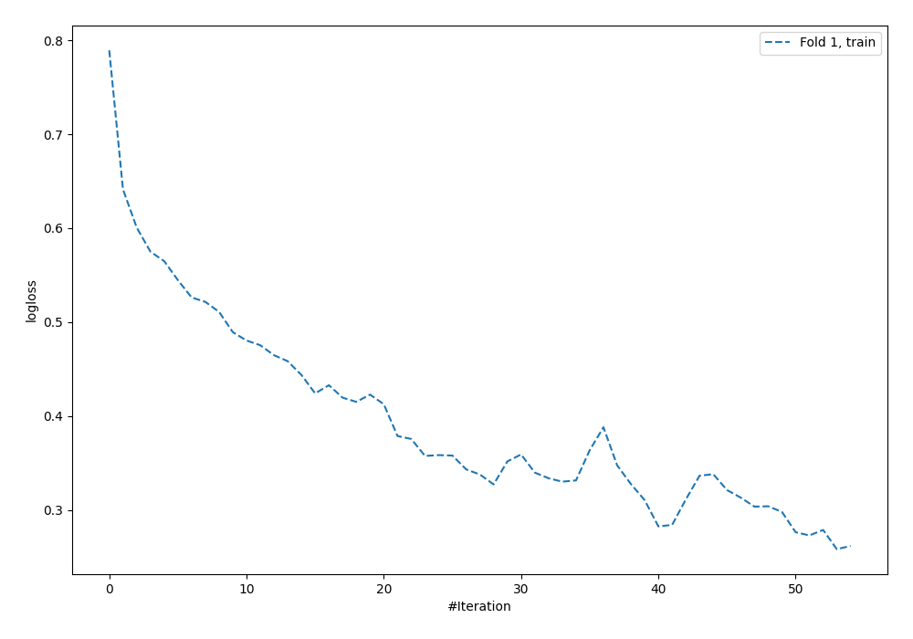
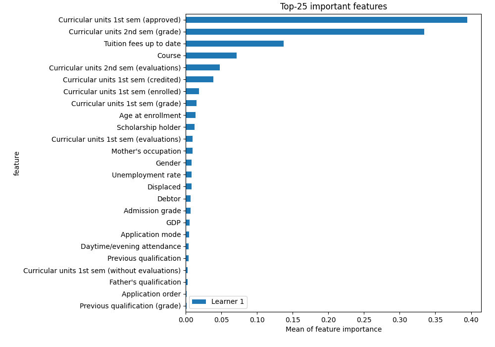
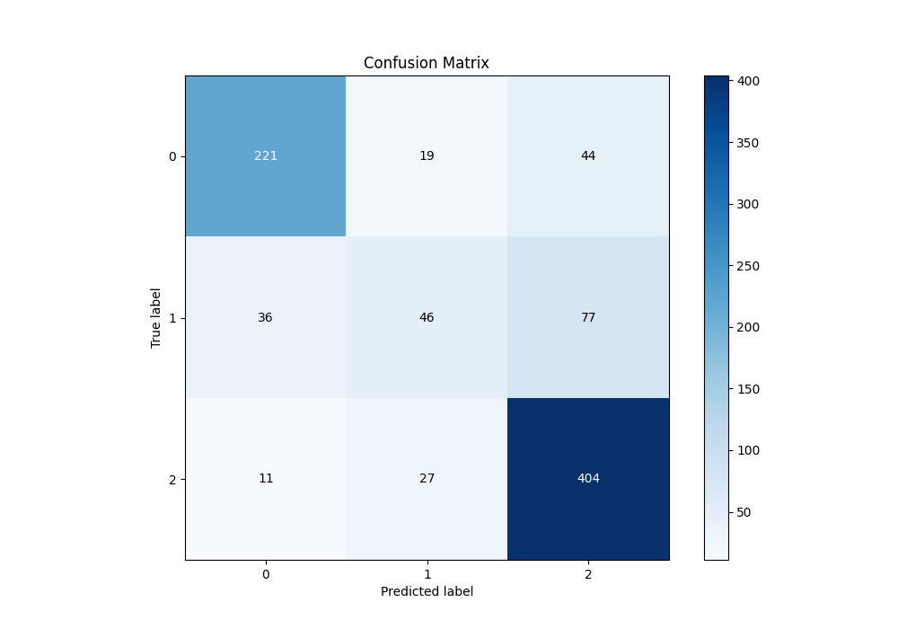
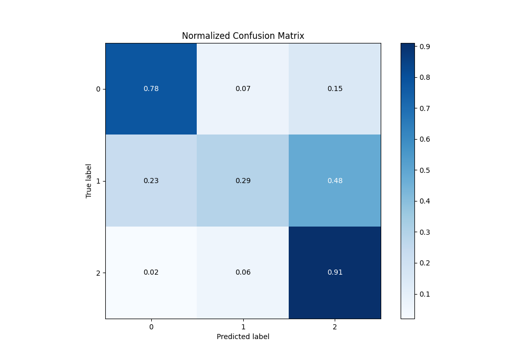
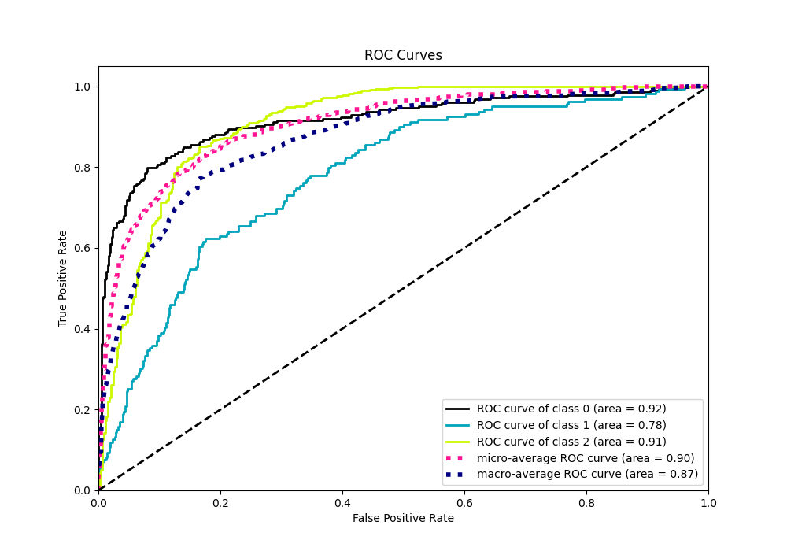
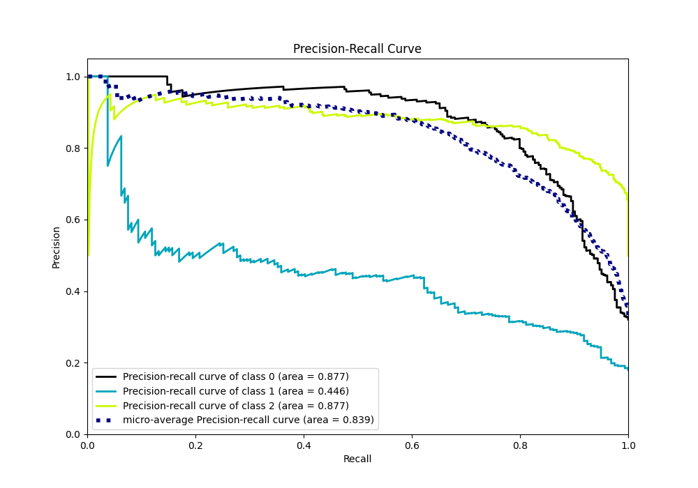

# Summary of 5_Default_NeuralNetwork

[<< Go back](../README.md)

## Neural Network
- **n_jobs**: -1
- **dense_1_size**: 32
- **dense_2_size**: 16
- **learning_rate**: 0.05
- **num_class**: 3
- **explain_level**: 2

## Validation
 - **validation_type**: split
 - **train_ratio**: 0.75
 - **shuffle**: True
 - **stratify**: True

## Optimized metric
logloss

## Training time

1.2 seconds

### Metric details
|           |          0 |          1 |          2 |   accuracy |   macro avg |   weighted avg |   logloss |
|:----------|-----------:|-----------:|-----------:|-----------:|------------:|---------------:|----------:|
| precision |   0.824627 |   0.5      |   0.769524 |   0.758192 |    0.69805  |       0.738784 |  0.615543 |
| recall    |   0.778169 |   0.289308 |   0.914027 |   0.758192 |    0.660501 |       0.758192 |  0.615543 |
| f1-score  |   0.800725 |   0.366534 |   0.835574 |   0.758192 |    0.667611 |       0.740122 |  0.615543 |
| support   | 284        | 159        | 442        |   0.758192 |  885        |     885        |  0.615543 |

## Confusion matrix
|              |   Predicted as 0 |   Predicted as 1 |   Predicted as 2 |
|:-------------|-----------------:|-----------------:|-----------------:|
| Labeled as 0 |              221 |               19 |               44 |
| Labeled as 1 |               36 |               46 |               77 |
| Labeled as 2 |               11 |               27 |              404 |

## Learning curves

## Permutation-based Importance

## Confusion Matrix

## Normalized Confusion Matrix

## ROC Curve

## Precision Recall Curve

[<< Go back](../README.md)
