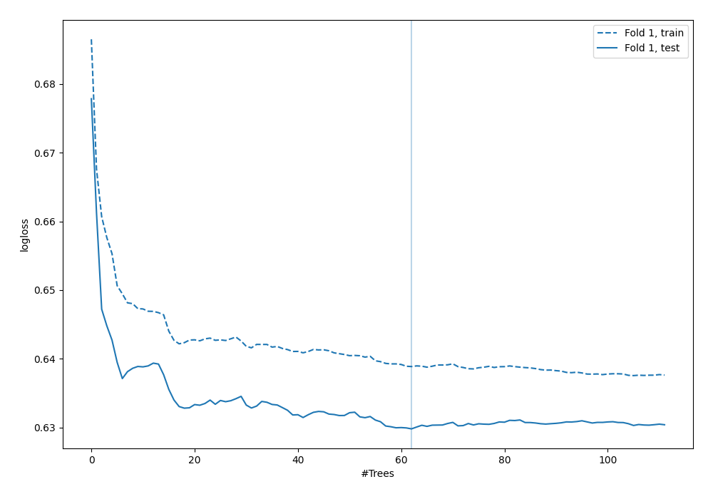
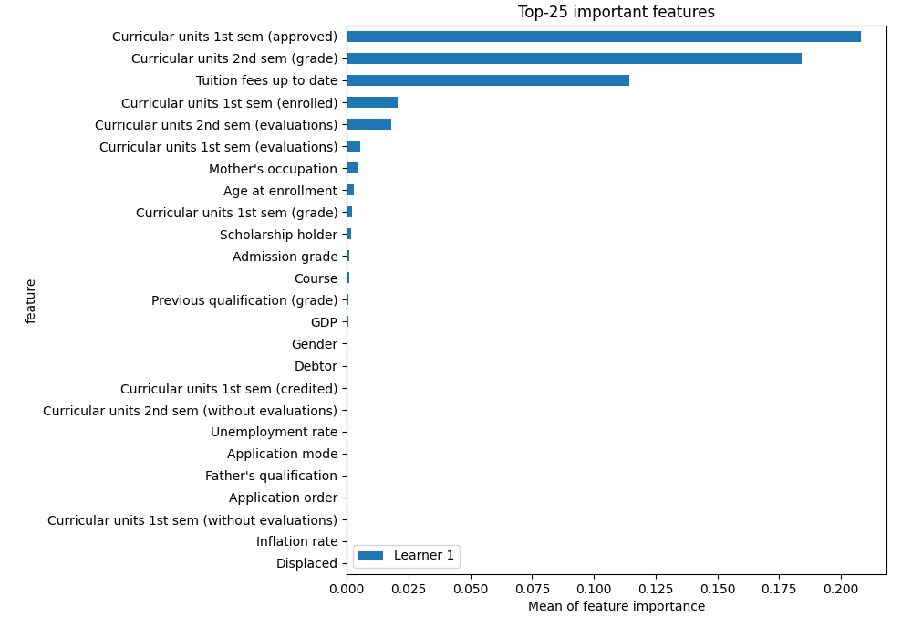
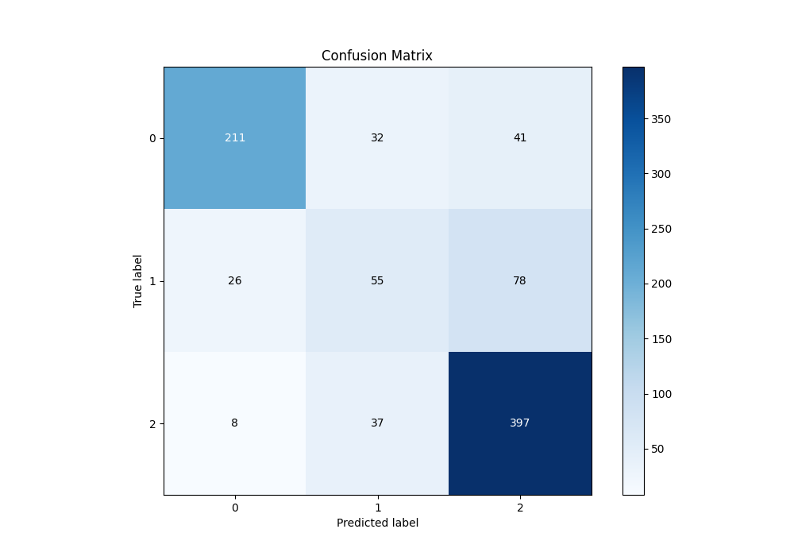
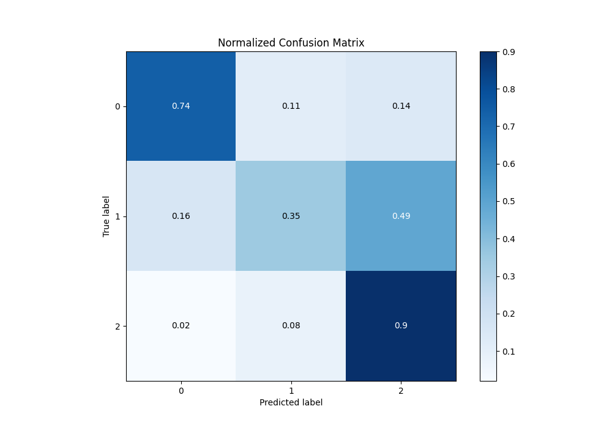
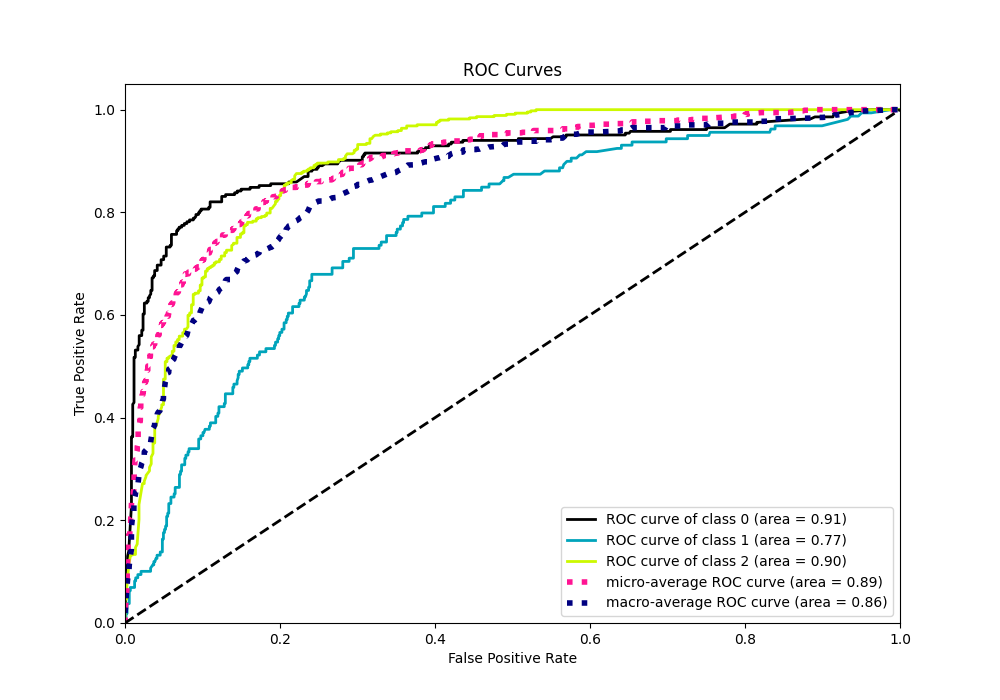
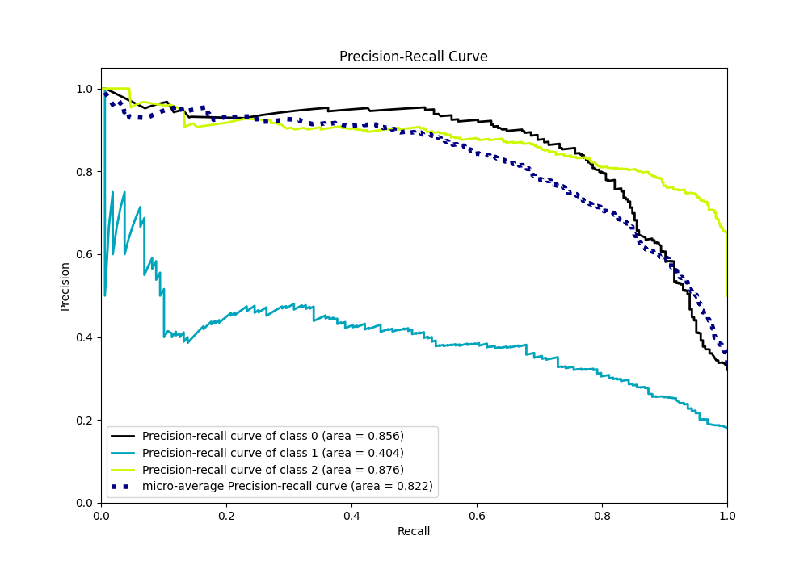

# Summary of 6_Default_RandomForest

[<< Go back](../README.md)

## Random Forest
- **n_jobs**: -1
- **criterion**: gini
- **max_features**: 0.9
- **min_samples_split**: 30
- **max_depth**: 4
- **eval_metric_name**: logloss
- **num_class**: 3
- **explain_level**: 2

## Validation
 - **validation_type**: split
 - **train_ratio**: 0.75
 - **shuffle**: True
 - **stratify**: True

## Optimized metric
logloss

## Training time

3.6 seconds

### Metric details
|           |          0 |          1 |         2 |   accuracy |   macro avg |   weighted avg |   logloss |
|:----------|-----------:|-----------:|----------:|-----------:|------------:|---------------:|----------:|
| precision |   0.861224 |   0.443548 |   0.76938 |   0.749153 |    0.691384 |       0.740314 |  0.629803 |
| recall    |   0.742958 |   0.345912 |   0.89819 |   0.749153 |    0.662353 |       0.749153 |  0.629803 |
| f1-score  |   0.797732 |   0.388693 |   0.82881 |   0.749153 |    0.671745 |       0.739765 |  0.629803 |
| support   | 284        | 159        | 442       |   0.749153 |  885        |     885        |  0.629803 |

## Confusion matrix
|              |   Predicted as 0 |   Predicted as 1 |   Predicted as 2 |
|:-------------|-----------------:|-----------------:|-----------------:|
| Labeled as 0 |              211 |               32 |               41 |
| Labeled as 1 |               26 |               55 |               78 |
| Labeled as 2 |                8 |               37 |              397 |

## Learning curves

## Permutation-based Importance

## Confusion Matrix

## Normalized Confusion Matrix

## ROC Curve

## Precision Recall Curve

[<< Go back](../README.md)
