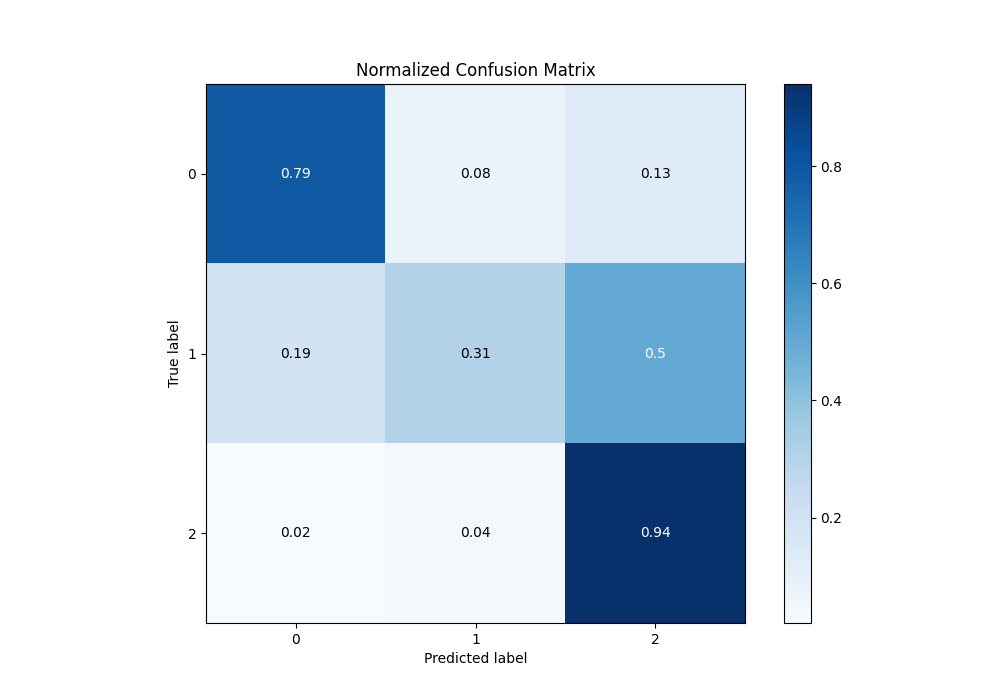

# Summary of Ensemble

[<< Go back](../README.md)

## Ensemble structure
| Model                   |   Weight |
|:------------------------|---------:|
| 3_Linear                |        1 |
| 4_Default_Xgboost       |        4 |
| 5_Default_NeuralNetwork |        1 |

### Metric details
|           |          0 |          1 |          2 |   accuracy |   macro avg |   weighted avg |   logloss |
|:----------|-----------:|-----------:|-----------:|-----------:|------------:|---------------:|----------:|
| precision |   0.851145 |   0.556818 |   0.779439 |   0.778531 |    0.729134 |       0.762454 |   0.55588 |
| recall    |   0.785211 |   0.308176 |   0.943439 |   0.778531 |    0.678942 |       0.778531 |   0.55588 |
| f1-score  |   0.81685  |   0.396761 |   0.853634 |   0.778531 |    0.689082 |       0.759747 |   0.55588 |
| support   | 284        | 159        | 442        |   0.778531 |  885        |     885        |   0.55588 |

## Confusion matrix
|              |   Predicted as 0 |   Predicted as 1 |   Predicted as 2 |
|:-------------|-----------------:|-----------------:|-----------------:|
| Labeled as 0 |              223 |               23 |               38 |
| Labeled as 1 |               30 |               49 |               80 |
| Labeled as 2 |                9 |               16 |              417 |

## Learning curves

## Confusion Matrix

## Normalized Confusion Matrix

## ROC Curve

## Precision Recall Curve

[<< Go back](../README.md)
